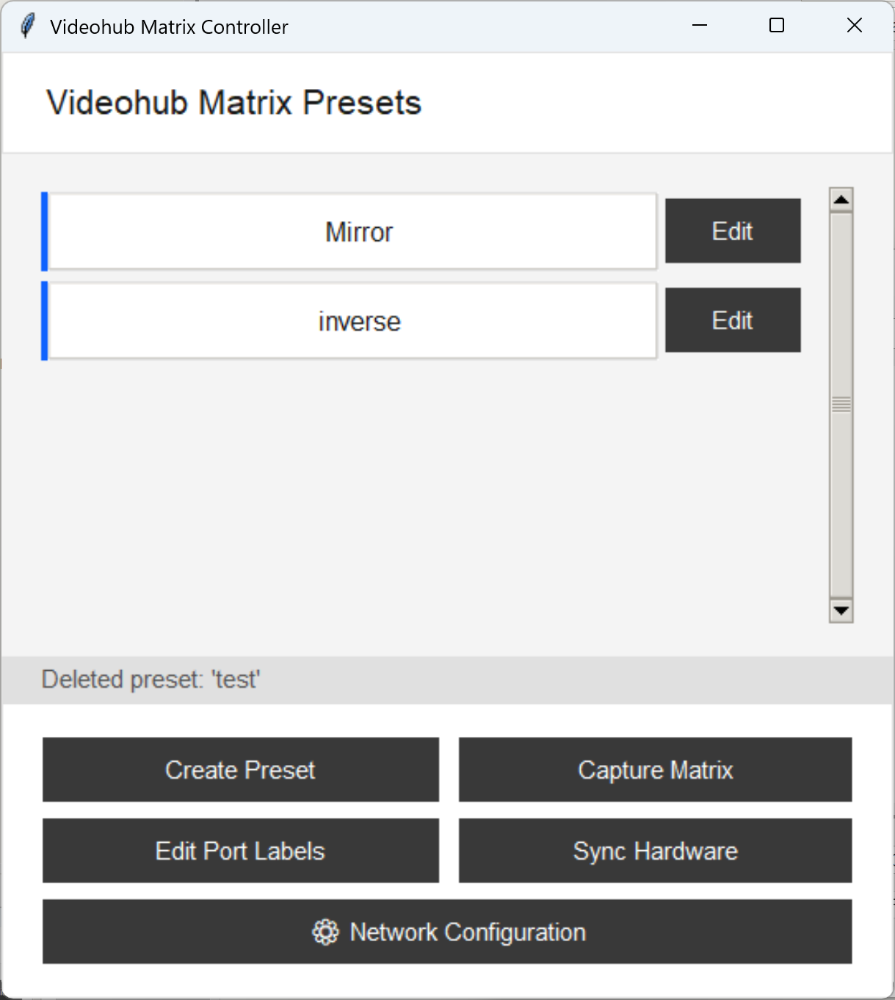
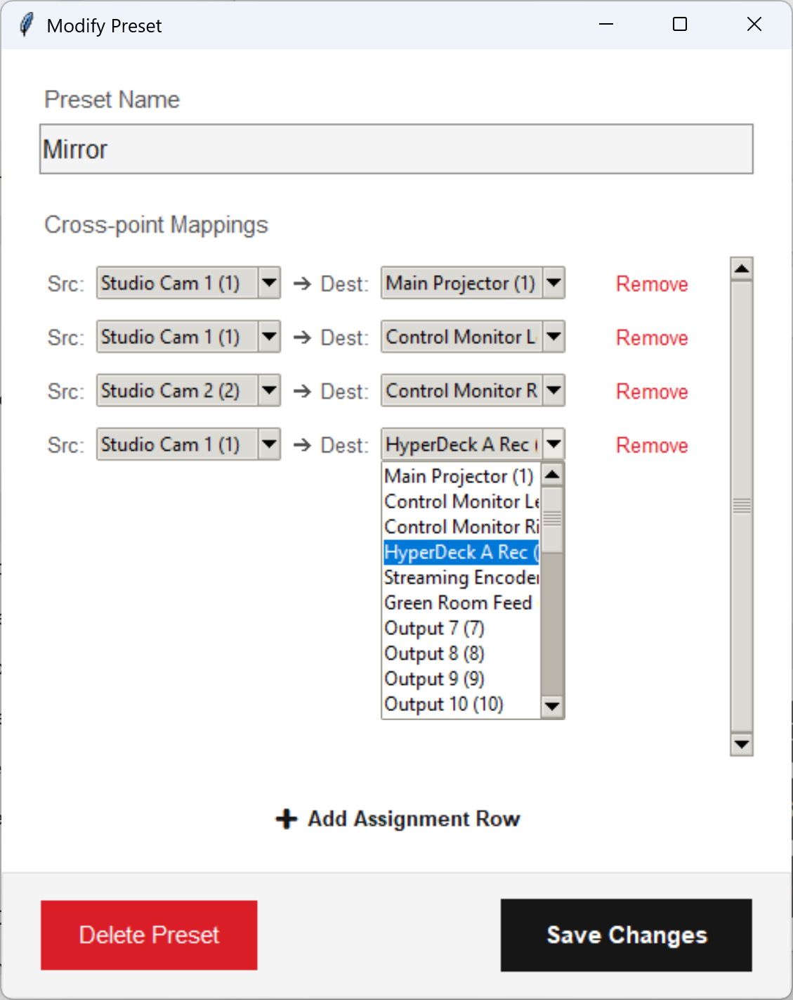
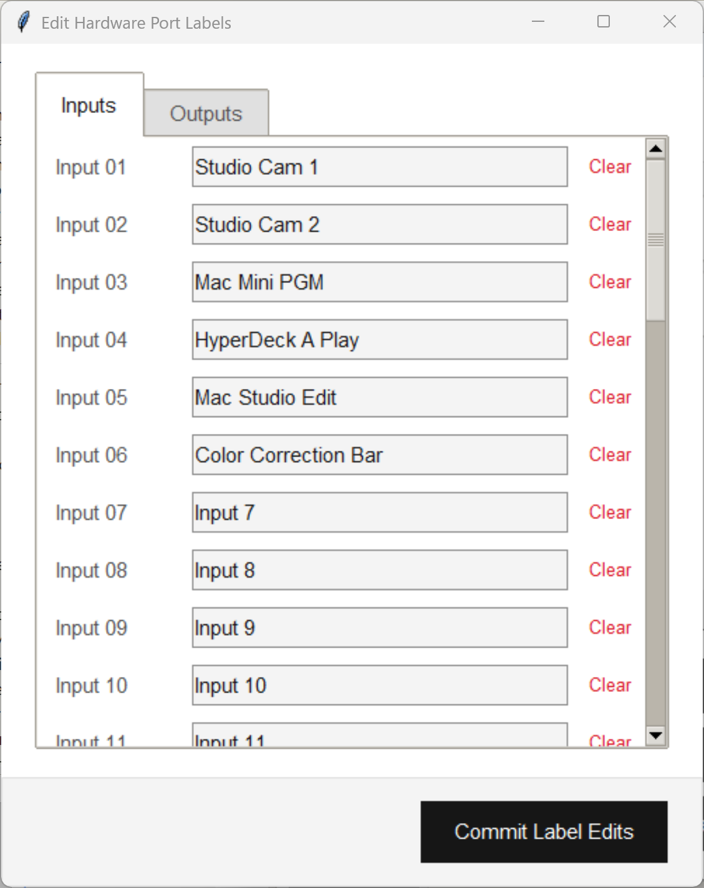
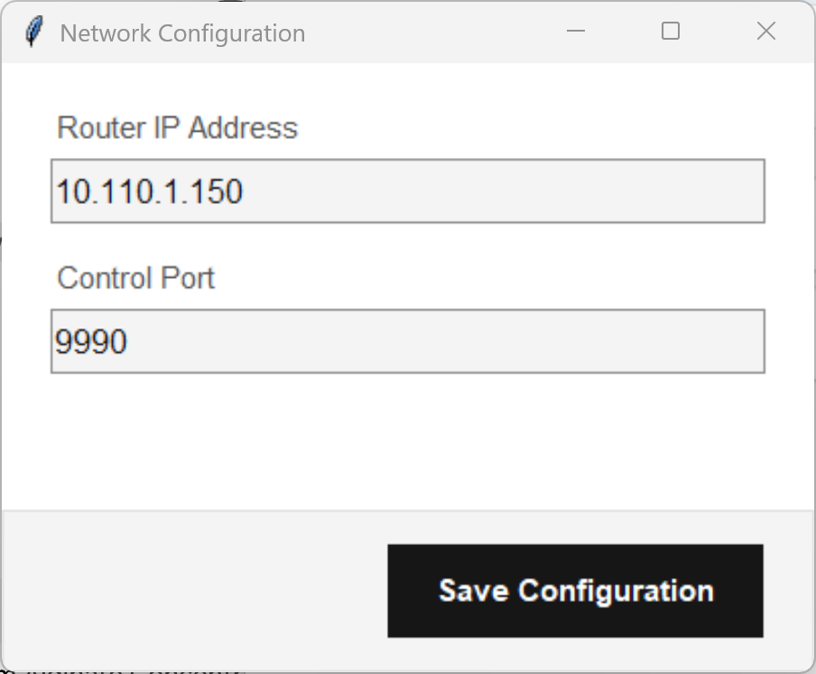

# Videohub Matrix Controller

A minimalist, high-efficiency desktop utility designed to manage cross-point macro configurations (salvos) on Blackmagic Design Videohub hardware routers. The user interface strictly follows the **IBM Carbon Design System (Gray 10 / White theme)** tokens to provide a clean, high-contrast, distraction-free environment for broadcast engineering.

---

## Key Interfaces

### Main Dashboard


### Matrix Preset Creator & Port Label Editor
| Preset Configuration | Label Synchronization |
| :---: | :---: |
|  |  |

### Network Configuration
| Network Configuration
| :---: |
|  |


---

## Prerequisites

The application is built on native Python frameworks to ensure minimal deployment friction in active master control rooms.

* **Python 3.10 or higher** (Tested natively through Python 3.13)
* Standard Python libraries (included in base distributions):
  * `tkinter` / `ttk` (Graphic layout engine)
  * `socket` (Network stream layer communication)
  * `json` (Local storage serialization)

---

## Setup & Deployment

1. **Clone the Repository**
```bash
git clone [https://github.com/YOUR_USERNAME/BlackMagic-Videohub-Matrix-Controller.git](https://github.com/YOUR_USERNAME/BlackMagic-Videohub-Matrix-Controller.git)
cd BlackMagic-Videohub-Matrix-Controller
```

2. **Run the Application**
Launch the interface directly using the Python interpreter:
```bash
python BlackMagic_Videohub_Matrix_Controller.py
```

---

## Configuration & Local Storage

Upon initial boot, the controller automatically initializes two local flat-file storage profiles in the root application directory:
* `BlackMagic_Videohub_Map.json`: Stores user-defined macro salvo routing states along with stateful Network IP and Port configurations.
* `Mock_Hardware_Labels.json`: Stores local hardware port mapping labels to serve as a baseline backup when running offline simulations.